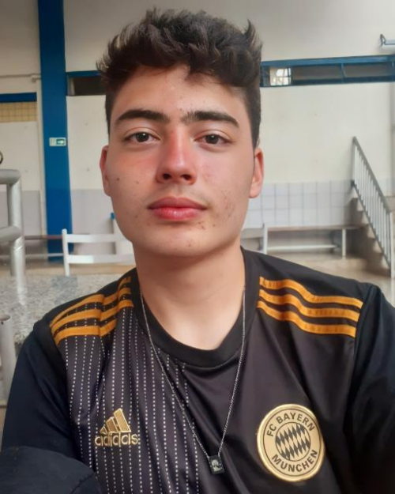

## SeuPontoDigital

Este projeto foi realizado durante a disciplina de Requisitos de Software, na Universidade de Brasília, sob orientação do Professor Dr. George Marsicano Correa. 

Mais detalhes sobre o projeto e documentação pode ser encontrada [aqui](https://mdsreq-fga-unb.github.io/2025.1-T01-SeuPontoDigital/).

  

O **SeuPontoDigital** é uma solução para controle de ponto eletrônico, criado para informatizar o registro da jornada de trabalho. Desenvolvido como um aplicativo mobile, o SeuPontoDigital tem como principal objetivo digitalizar a marcação de ponto dos funcionários via geolocalização, calculando as horas trabalhadas e enviando todas as informações diretamente ao empregador e/ou contador responsável.

## Equipe 

  

    

      
      
<strong>Caio Venâncio</strong>

      
Product Owner e Scrum Master

    

    

      
      
<strong>Davi de Aguiar</strong>

      
Desenvolvedor Mobile

    

    

      
      
<strong>Guilherme Moura</strong>

      
Desenvolvedor Backend

    

    

      
      
<strong>João Pedro Ferreira</strong>

      
Desenvolvedor Backend

    

  

  

    

      
      
<strong>Lucas Guimarães</strong>

      
Designer UX/UI e Desenvolvedor Mobile

    

    

      
      
<strong>Thiago Melo</strong>

      
Desenvolvedor Mobile

    

    

      
      
<strong>Willian Xavier</strong>

      
Tester e Desenvolvedor Backend

    

  

