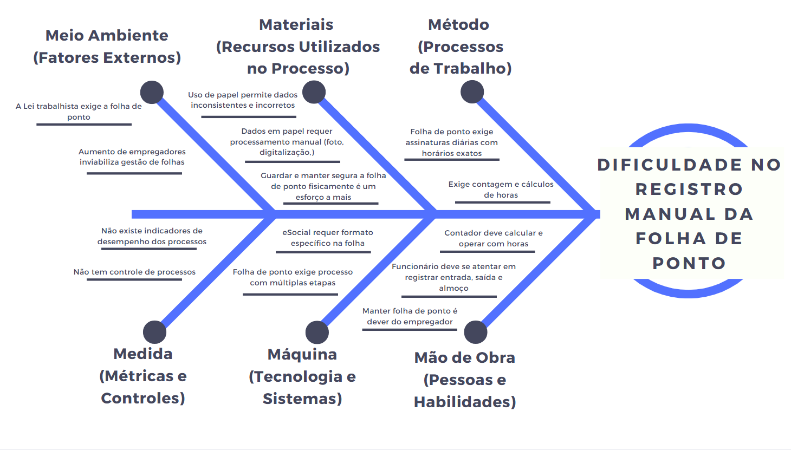

## Introdução ao Negócio e Contexto 

A *Legalize Folha de Pagamento do Lar LTDA (Legalize Folha Doméstica)* é uma empresa que atua no Distrito Federal e região, especializada na gestão de folha de pagamento doméstica, ativa no mercado desde janeiro de 2024 e vem crescendo de forma significativa. A empresa oferece serviços aos empregadores, sendo responsável por gerenciar todo o ciclo de vida da carteira de trabalho dos empregados, com foco nas empregadas domésticas.

A missão da empresa é simplificar e assegurar de forma legal como os empregadores contratam os serviços domésticos, proporcionando uma experiência personalizada e transparente. Por ser uma empresa recente, ela ainda não conta com todas as funcionalidades que outras competidoras oferecem. No entanto, é fundamental que os custos dos serviços não sejam elevados, ao mesmo tempo em que a qualidade do serviço entregue se mantenha competitiva no mercado.

---

## Identificação da Oportunidade ou Problema 

A principal oportunidade identificada para a *Legalize Folha Doméstica* é a gestão da folha de ponto, que, atualmente, é lenta e suscetível a erros, pois depende da marcação manual e diária por parte do empregado. A falta de um sistema mais informatizado gera falhas recorrentes, como o acúmulo de horas trabalhadas não contabilizadas, o que resulta em direitos de horas extras não registradas e, muitas vezes, no esforço para contestar em uma ação trabalhista. Além disso, a empresa constata que uma grande parte dos empregadores no Brasil não mantém em dia a folha de ponto, o que limita os direitos dos empregados e dificulta a justiça por parte dos empregadores.

De acordo com a [Lei Complementar 150](https://www.planalto.gov.br/ccivil_03/leis/lcp/lcp150.htm), que regula o contrato doméstico, a folha de ponto é obrigatória, e a sua ausência pode resultar em riscos judiciais para o empregador. A  Legalize Folha Doméstica percebeu que, sem uma solução automatizada, perderá uma parte significativa do mercado para concorrentes que já oferecem tecnologias mais avançadas. Nesse contexto, a empresa vê uma grande oportunidade de crescimento, tanto na competitividade quanto na praticidade, ao reduzir o tempo necessário para a contabilização das horas trabalhadas, adotada na rotina de trabalho atual. 

A figura a seguir apresenta um Diagrama de Ishikawa com nossa exploração sobre o problema enfretado pela *Legalize Folha Doméstica*.

É possível perceber através do diagrama que alguns desses aspectos do problema são passíveis de solução via tecnologia, enquanto outros não.

*O que está sendo resolvido:*

  - **Quanto ao Meio Ambiente:** a solução possibilita escalabilidade para o aumento de folhas a serem geridas pela empresa.
  - **Quanto aos Materiais:** o uso de papel e a necessidade de digitalização manual seria dispensada, além da folha se manter segura digitalmente.
  - **Quanto aos Métodos:** a necessidade da precisão dos horários, a diminuição do tempo de contagem e cálculo de horas pode ser resolvidas.
  - **Quanto à Medida:** uma solução tecnológica admite indicadores de desempenho e controle de processos.
  - **Quanto a Máquina:** as múltiplas etapas de criação da folha de ponto persistiram.
  - **Quanto à Mão de obra:** o contador e o empregador terão menos tempo de trabalho de manutenção da folha, e menos dificuldade.

*O que não está sendo resolvido:*

  - **Quanto ao Meio Ambiente:** a folha de ponto ainda deve ser criada e enviado no e-Social, um fator externo obrigatório por lei.
  - **Quanto à Mão de Obra:** ainda será necessário que o empregador se atente ao ponto diáriamente.
  - **Quanto a Máquina:** as múltiplas etapas de criação da folha de ponto persistiram (o empregador precisa assinar uma folha física ao fim do mês, contador precisa verificar se os dados estão no formato certo, dentre outras etapas).

Nesse contexto, observa-se que a digitalização da folha de ponto resolveria questões como demora, precisão na marcação, contagem de horas trabalhadas e salário baseado na folha de ponto, eliminando inconsistências e reduzindo tempo de processamento. No entanto, não resolveria outros problemas como a necessidade de o empregado manter-se atento aos registros.

---

##  Desafios do Projeto

O principal desafio técnico do projeto é efetivar a migração dos dados dos cliente da empresa *Legalize Folha Doméstica* para o aplicativo *SeuPontoDigital*, além de garantir que a marcação do ponto seja informatizada sem comprometer o ciclo atual. Isso envolve integrar funcionalidades como geolocalização, notificações e cálculos automáticos de horas em tempo real, de forma a atender integralmente os requisitos da [Lei Complementar 150](https://www.planalto.gov.br/ccivil_03/leis/lcp/lcp150.htm).

Outro desafio significativo é a capacitação da nossa equipe, reduzida, e com pouca experiência em soluções digitais, exigindo treinamentos e estudo contínuo. Ademais, a equipe precisa assegurar que a transição dos dados para o aplicativo não comprometa a continuidade operacional, mantendo o fluxo de registros e pagamentos ininterrupto.

---
## Segmentação de Clientes 

A *Legalize Folha Doméstica* atende a dois principais segmentos de clientes:

- **Empregadores Individuais:**

    São pessoas físicas que contratam empregados domésticos e buscam praticidade e segurança no controle da jornada de trabalho.

- **Donos de Pequenas Empresas e Startups do Setor Doméstico:**

    Negócios em fase de crescimento que desejam informatizar a gestão da folha dos pontos.

## Historico de Versão
Data     | Versão | Descrição | Autor(es) | Revisor(es)
-------- | ------ | --------- | ----- | ---------
15/04/2025 | 1.0 | Introdução ao Negócio e Contexto | João Pedro Ferreira  | Lucas Guimarães |
18/04/2025 | 1.1 | Introdução ao Negócio e Contexto | Caio Venâncio | Lucas Guimarães |
19/04/2025 | 1.2 | Identificação da Oportunidade e Problema e Diagrama de Ishikawa | Caio Venâncio | Lucas Guimarães|
19/04/2025 | 1.3 | Correção e revisão do Cenário Atual do Cliente e do Negócio |  Lucas Guimarães |Caio Venâncio |
