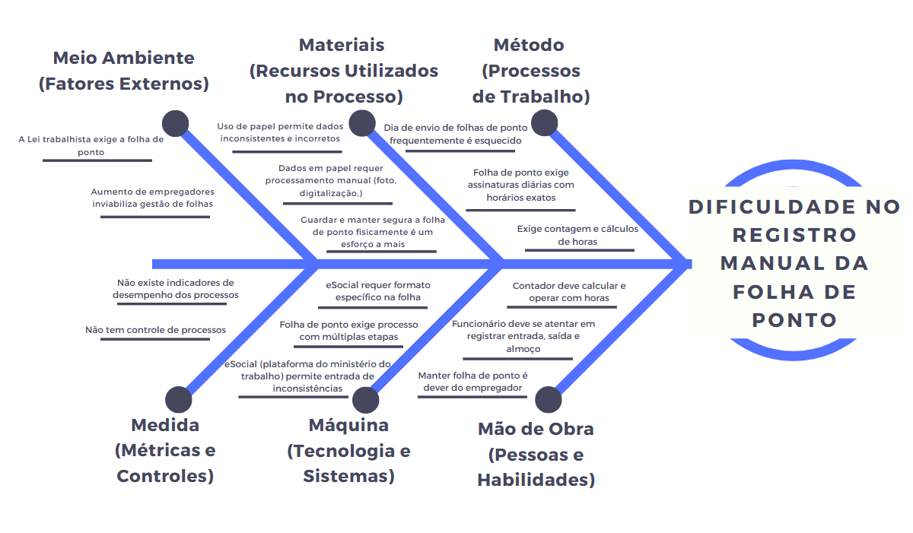

## Introdução ao Negócio e Contexto 

A *Legalize Folha de Pagamento do Lar LTDA (Legalize Folha Doméstica)* é uma empresa sediada no Distrito Federal, especializada na gestão de folha de pagamento doméstica. Atua no mercado desde janeiro de 2024 e vem crescendo de forma significativa. Oferece serviços voltados a empregadores, sendo responsável por gerenciar todo o ciclo de vida da carteira de trabalho dos empregados domésticos por eles contratados, com foco especial nas empregadas domésticas.

A missão da empresa é simplificar e legalizar o processo de contratação de serviços domésticos, oferecendo uma experiência personalizada e transparente para os empregadores. Para a empresa, é essencial manter os custos dos serviços acessíveis, sem comprometer a qualidade dos serviços prestados, garantindo competitividade no mercado. Entretanto, por ser uma empresa recente, ainda não dispõe de todos os recursos que algumas concorrentes oferecem.

---

## Identificação da Oportunidade ou Problema 

A principal oportunidade identificada para a *Legalize Folha Doméstica* é a gestão da folha de ponto, que atualmente é um processo lento e sujeito a erros, pois depende da marcação manual diária feita pelo empregado. A ausência de um sistema informatizado contribui para falhas recorrentes, como o acúmulo de horas trabalhadas não contabilizadas, resultando em horas extras não registradas e, frequentemente, em disputas trabalhistas. Além disso, a empresa constata que uma grande parte dos empregadores não mantém a folha de ponto atualizada, o que compromete os direitos dos empregados e, ao mesmo tempo, prejudica a segurança jurídica dos empregadores.

De acordo com a [Lei Complementar 150](https://www.planalto.gov.br/ccivil_03/leis/lcp/lcp150.htm), que regula o contrato de trabalho doméstico, a manutenção da folha de ponto é obrigatória, e sua ausência pode gerar riscos judiciais para o empregador. A  *Legalize Folha Doméstica* percebeu que, sem uma solução automatizada, pode perder espaço no mercado para concorrentes que já oferecem serviços tecnológicos na área. Nesse contexto, a empresa enxerga uma grande oportunidade de crescimento - tanto em competitividade quanto em praticidade - ao reduzir o tempo necessário para a contabilização das horas trabalhadas e para a gestão da folha de pagamento, otimizando tarefas essenciais da rotina dos empregadores.

A figura a seguir apresenta o Diagrama de Ishikawa sobre o problema enfretado pela *Legalize Folha Doméstica*:

É possível perceber, por meio do diagrama, que alguns desses aspectos do problema podem ser resolvidos com o uso da tecnologia, enquanto outros não.

*O que está sendo resolvido:*

  - **Quanto ao Meio Ambiente:** a solução possibilita escalabilidade para o aumento de folhas a serem geridas pela empresa.
  - **Quanto aos Materiais:** o uso de papel e a necessidade de digitalização manual seria dispensada, além da folha se manter segura digitalmente.
  - **Quanto aos Métodos:** a necessidade da precisão dos horários, a diminuição do tempo de contagem e cálculo de horas trabalhadas podem ser resolvidas. Também seria possível enviar o registro dos pontos automaticamente em qualquer data desejada.
  - **Quanto à Medida:** uma solução tecnológica admite indicadores de desempenho e controle de processos.
  - **Quanto à Mão de obra:** o contador e o empregador terá menos tempo de trabalho de manutenção da folha, e menos dificuldade.

*O que não está sendo resolvido:*

  - **Quanto ao Meio Ambiente:** a folha de ponto ainda deve ser criada e enviado no e-Social, um fator externo obrigatório por lei.
  - **Quanto à Mão de Obra:** ainda será necessário que o empregador se atente ao ponto diariamente.
  - **Quanto a Máquina:** as múltiplas etapas de criação da folha de ponto persistiram (o empregador precisa assinar uma folha física ao fim do mês e a *Legalize Folha Doméstica* precisa verificar se os dados estão no formato certo, dentre outras etapas). Também não seria possível impedir que dados incorretos sejam preenchidos no sistema do [eSocial](https://www.gov.br/esocial/pt-br) (plataforma do Governo Brasileiro para submeter documentos ao Ministério do Trabalho).

Nesse contexto, observa-se que a digitalização da folha de ponto resolveria questões como demora, precisão na marcação e contagem de horas, eliminando inconsistências e reduzindo tempo de processamento. No entanto, não resolveria outros problemas como, por exemplo, a necessidade de o empregado manter-se atento aos registros.

---

##  Desafios do Projeto

O principal desafio técnico do projeto é realizar a migração dos dados dos clientes da empresa *Legalize Folha Doméstica* para o aplicativo *SeuPontoDigital*, assegurando que a nova marcação de ponto informatizada não comprometa o ciclo de trabalho atual. Isso requer a integração de funcionalidades como geolocalização, notificações e cálculos automáticos de horas em tempo real, de forma a atender integralmente os requisitos estabelecidos pela [Lei Complementar 150](https://www.planalto.gov.br/ccivil_03/leis/lcp/lcp150.htm).

Outro desafio significativo é a capacitação da equipe que irá desenvolver o produto, pois é reduzida e possui pouca experiência com soluções digitais, o que exige treinamentos específicos e aprendizado contínuo.

---

## Segmentação de Clientes 

A *Legalize Folha Doméstica* atende a dois principais segmentos de clientes:

- **Empregadores Domésticos Individuais:**

    Pessoas físicas que contratam empregados domésticos e buscam praticidade e segurança no controle da jornada de trabalho.

- **Donos de Pequenas Empresas e Startups do Setor Doméstico:**

    Negócios em crescimento que desejam informatizar a gestão da folha dos pontos, otimizando processos e garantindo conformidade.

## Historico de Versão
Data     | Versão | Descrição | Autor(es) | Revisor(es)
-------- | ------ | --------- | ----- | ---------
15/04/2025 | 1.0 | Introdução ao Negócio e Contexto | João Pedro Ferreira  | Lucas Guimarães |
18/04/2025 | 1.1 | Introdução ao Negócio e Contexto | Caio Venâncio | Lucas Guimarães |
19/04/2025 | 1.2 | Identificação da Oportunidade e Problema e Diagrama de Ishikawa | Caio Venâncio | Lucas Guimarães|
19/04/2025 | 1.3 | Correção e revisão do Cenário Atual do Cliente e do Negócio |  Lucas Guimarães |Caio Venâncio |
