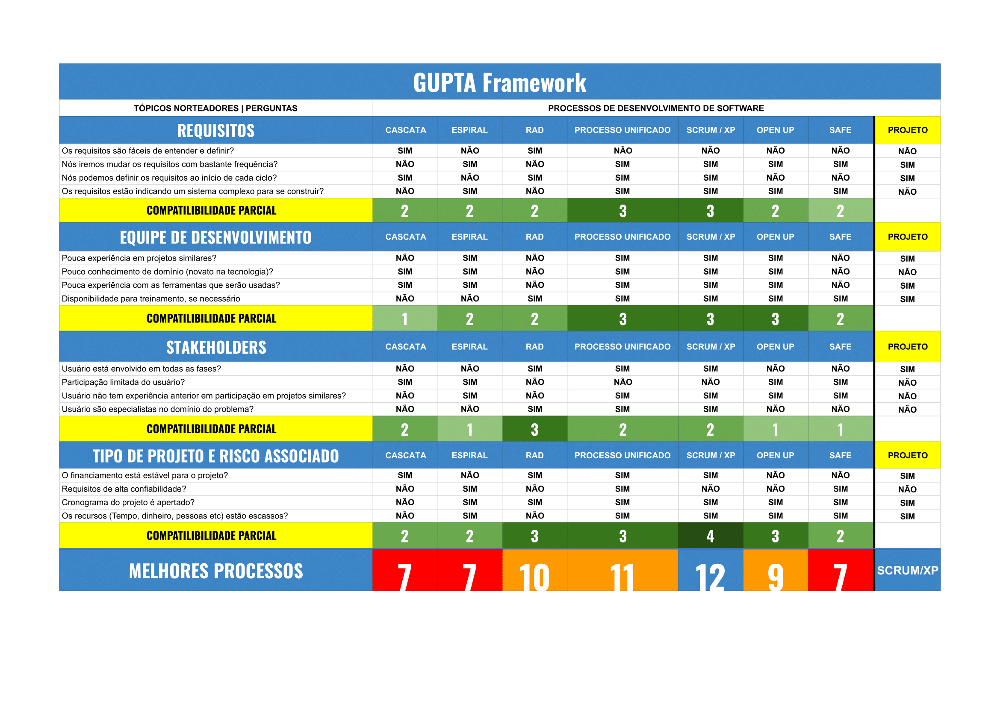

## Estratégia Priorizada

**Abordagem de Desenvolvimento de Software:** Ágil

**Ciclo de vida:** Iterativo e Incremental 

**Processo de Engenharia de Software:** XP com práticas do Scrum

---
## Quadro Comparativo 

<table border="1" cellspacing="0" cellpadding="4">
  <thead>
    <tr>
      <th style="text-align: center;">Características</th>
      <th style="text-align: center;">XP (eXtreme Programming)</th>
      <th style="text-align: center;">AUP (Agile Unified Process)</th>
    </tr>
  </thead>
  <tbody>
    <tr>
      <td>Abordagem Geral</td>
      <td>Iterativo e incremental, com entregas contínuas e feedbacks constantes</td>
      <td>Iterativo e incremental, baseado no processo RUP (Rational Unified Process)</td>
    </tr>
    <tr>
      <td>Foco em arquitetura</td>
      <td>Arquitetura não é o foco no início do projeto, sendo desenvolvida ao decorrer das iterações e incrementos</td>
      <td>Foco em arquitetura baseada em riscos. É proposto identificar uma arquitetura para o projeto na fase de iniciação e na fase de elaboração, a arquitetura é colocada à prova</td>
    </tr>
    <tr>
      <td>Estrutura de Processos</td>
      <td>Focada em sprints curtas (1 - 2 semanas) e flexíveis com pequenas entregas ao final de cada sprint</td>
      <td>Focado em iterações (1 - 4 semanas) e quatro fases sequenciais: Concepção, Elaboração, Construção e Transição</td>
    </tr>
    <tr>
      <td>Flexibilidade de Requisitos</td>
      <td>Alta flexibilidade durante todo o projeto fundamentada pelo feedback constante do cliente</td>
      <td>Permite mudanças durante todo o ciclo de vida do projeto</td>
    </tr>
    <tr>
      <td>Colaboração com o cliente</td>
      <td>Envolvimento do cliente em todas as sprints, com feedbacks ao final de cada sprint</td>
      <td>Envolvimento e feedback do cliente ao longo de todo o projeto durante as frequentes demonstrações</td>
    </tr>
    <tr>
      <td>Complexidade do processo</td>
      <td>Processo mais "simples". Com foco menor em documentação, e foco maior na entrega contínua</td>
      <td>Complexidade um pouco maior, pois combina a estruturação dos processos do RUP com práticas ágeis</td>
    </tr>
    <tr>
      <td>Controle de Qualidade</td>
      <td>Controle de qualidade de acordo com as práticas do XP, como TDD e integração contínua</td>
      <td>Incorporta práticas como desenvolvimento orientado a testes, validação contínua e feedbacks do usuário</td>
    </tr>
    <tr>
      <td>Documentação</td>
      <td>Documentação mínima, apenas o essencial</td>
      <td>Adota o princípio de "documentação suficiente", apenas o necessário para atender às necessidades do projeto</td>
    </tr>
    <tr>
      <td>Escalabilidade</td>
      <td>Difícil escalar para projetos maiores, pois é voltado para equipes pequenas</td>
      <td>Escalável para projetos médios e grandes</td>
    </tr>
    <tr>
      <td>Suporte a Equipes de Desenvolvimento</td>
      <td>Equipes menores e com papéis flexíveis, permite maior adaptação durante o projeto</td>
      <td>Menos adequado para equipes inexperientes, recomendado para equipes com experiência mista</td>
    </tr>
  </tbody>
</table>

---
## Justificativa 

A escolha do XP com práticas do Scrum foi baseada em três principais fatores, sendo eles:

- Cliente disponível na maior do tempo, facilitando as entregas contínuas, oferecendo feedbacks constantes em todas as sprints e podendo participar de todas as sprints review.
- Equipe pequena, papéis flexíveis e pouco conhecimento em desenvolvimento mobile, permitindo que os membros participem de várias etapas e possam se adaptar durante o projeto, sendo mais eficiente que o AUP, voltado para equipes mistas ou com algum conhecimento prévio
- Flexibilidade durante todo o projeto, permitindo que algumas mudanças possam ocorrer sem prejudicar todo o andamento do projeto.

Além disso, utilizamos uma versão adaptada do GUPTA Framework para ajudar na escolha do melhor processo. Segue imagem abaixo:

 *Obs:* caso a imagem esteja pequena, clique nela para visualizar melhor.

---
## Historico de Versão
Data     | Versão | Descrição | Autor(es) | Revisor(es)
-------- | ------ | --------- | ----- | ---------
15/04/2025 | 1.0 | Estratégia priorizada para o projeto| Lucas Guimarães |