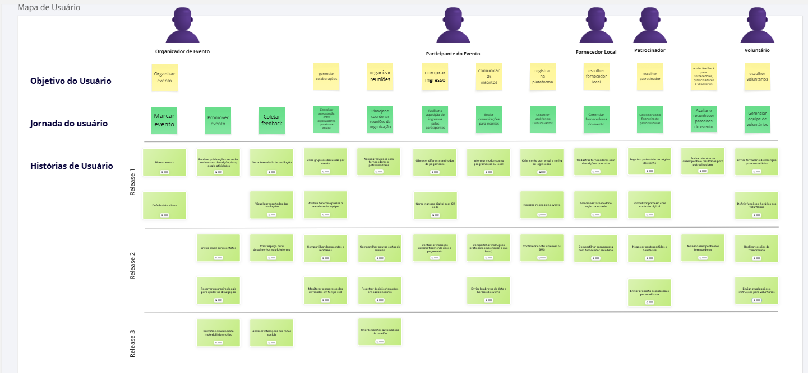
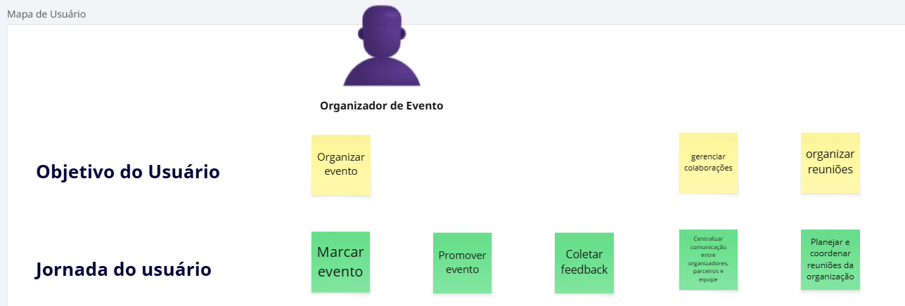
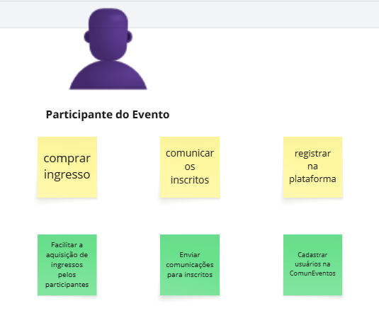
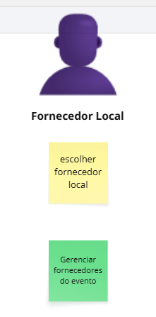
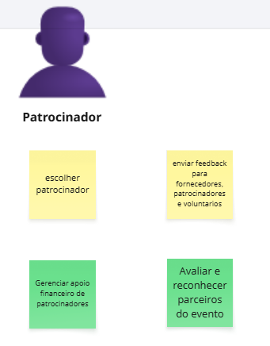
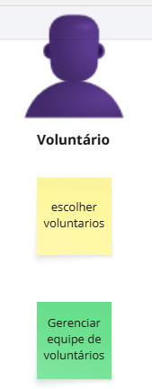

## User Story Mapping - ComunEventos

  
Este conteúdo vem do Miro. Clique abaixo para carregar o embed:

  <button onclick="loadMiro()"><a>Carregar Mapa no Miro</a></button>

<!-- <iframe width="768" height="432" src="https://miro.com/app/live-embed/uXjVInpQKj4=/?embedMode=view_only_without_ui&moveToViewport=-3193,-2302,4166,2268&embedId=238208750994" frameborder="0" scrolling="no" allow="fullscreen; clipboard-read; clipboard-write" allowfullscreen></iframe> -->

## Introdução
A ComunEventos é uma startup dedicada a criar uma plataforma para otimizar a experiência de organizadores e participantes de eventos comunitários. O produto integra ferramentas de gerenciamento de eventos, comunicação, inscrição, pagamentos, colaboração com fornecedores, patrocínios e voluntários, resolvendo desafios como:

- Fragmentação de informações em múltiplas planilhas e canais de mensagem.
- Dificuldade de engajar e coordenar participantes, fornecedores, patrocinadores e voluntários.
- Falta de um canal único de comunicação e feedback.
- Necessidade de recursos acessíveis e escaláveis para eventos de diversos tamanhos.

O objetivo é oferecer ao mercado uma solução única, intuitiva e acessível, capaz de cobrir todas as etapas de um evento — desde o planejamento até o pós-evento — com um fluxo integrado de cadastro, comunicação, pagamento e coleta de feedback.

## User Story Map da ComunEventos

|       Atores          |                      Objetivos                          |                            Atividades Principais                     |
|---------------------- | ------------------------------------------------------- | -------------------------------------------------------------------- |
|Organizador de Evento  | Organizar evento, Gerenciar colaborações                | Marcar evento, Promover evento, Coletar feedback, Organizar reuniões | 
|Participante de Evento | Comprar ingresso, Comunicar-se, Compartilhar impressões | Registrar na plataforma, Comprar ingresso, Comunicar com inscritos   | 
|Fornecedor Local       | Registrar na plataforma, Escolher fornecedor            | Cadastrar fornecedores, Gerenciar fornecedores                       | 
|Patrocinador           | Escolher patrocinador, Enviar feedback                  | Selecionar patrocinador, Gerenciar apoio financeiro                  | 
|Voluntário             | Escolher voluntários, Gerenciar equipe                  | Definir funções e horários, Organizar equipe de voluntários          | 

## Usuários (Personas)
##### 1. Organizador de Evento
- Busca uma visão centralizada de todas as etapas de planejamento.
- Precisa integrar agenda, inscrições, comunicação e relatórios de feedback.

##### 2. Participante de Evento
- Quer facilidade para se inscrever e receber informações em tempo real.
- Deseja métodos de pagamento diversos e ingressos digitais (QR Code).

##### 3. Fornecedor Local 
- Precisa registrar serviços, preços e contatos de forma clara.
- Busca visibilidade e agendamento de participação em eventos.

##### 4. Patrocinador
- Quer propor e formalizar apoio de forma digital, receber relatórios de retorno.
- Avalia parcerias com base em público e resultados anteriores.

##### 5. Voluntário 
- Deseja se inscrever para colaborar, ter clareza de funções e horários.
- Precisa de instruções e acesso a materiais de suporte.

## Objetivos de usuário
- **Organizador de Evento:** Centralizar o planejamento e acompanhamento de todas as atividades e colaborações.
- **Participante de Evento:** Facilitar inscrição, pagamento e acesso às informações do evento.
- **Fornecedor Local:** Gerenciar serviços e acordos de modo ágil.
- **Patrocinador:** Propor e formalizar patrocínios digitalmente, acompanhar resultados.
- **Voluntário:** Inscrever-se, receber instruções e gerenciar sua participação.

## Jornadas de usuário

##### 1. Organizador de Evento

- Marcar evento → Promover evento (redes sociais, site) → Organizar reuniões → Coletar feedback → Ajustar planejamento.

##### 2. Participante de Evento

- Registrar na plataforma → Comprar ingresso → Receber confirmação e QR Code → Acompanhar programação → Enviar feedback.

##### 3. Fornecedor Local

- Registrar serviço → Escolher eventos → Negociar contrato → Fornecer serviço → Avaliar resultados.

##### 4. Patrocinador

- Buscar eventos → Enviar proposta → Formalizar contrato digital → Acompanhar métricas.

##### 5. Voluntário

- Visualizar vagas → Preencher inscrição → Receber instruções → Participar → Relatar experiência.

## Detalhamento por Backnone - ComunEventos

#### BB01 - Gerenciar Eventos

##### Atividade: Marcar Evento
US01: Marcar Evento 
- "Eu, como organizador de evento, quero marcar um novo evento na plataforma para iniciar seu planejamento e torná-lo visível aos participantes."

US02: Definir data e hora
- "Eu, como organizador de evento, quero definir a data e hora do evento para garantir que todos os envolvidos possam se planejar adequadamente."

##### Atividade: Promover Evento

US03: Realizar publicações em redes sociais com descrição, data, local e atividades
- "Eu, como organizador de evento, quero realizar publicações integradas em redes sociais para divulgar o evento e atrair mais participantes da comunidade."

US04: Enviar email para contatos
- "Eu, como organizador de evento, quero enviar emails para meus contatos cadastrados a fim de divulgar o evento e aumentar o número de inscritos."

US05: Recorrer a parceiros locais para ajudar na divulgação
- "Eu, como organizador de evento, quero recorrer a parceiros locais para ajudar na divulgação do evento, aproveitando sua rede de contatos e influência na comunidade."

US06: Permitir o download de material informativo
- "Eu, como organizador do evento, quero poder disponibilizar o download de materiais informativos relacionados ao evento para os participantes se informarem com antecedência, atualizando em tempo real caso haja mudanças"

##### Atividade: Coletar feedback
US07: Gerar formulário de avaliação
- "Eu, como organizador do evento, quero poder gerar um formulário de avaliação para coletar feedback dos participantes." 

US08: Visualizar resultados das avaliações
- "Eu, como organizador do evento, quero poder visualizar as avaliações dos participantes para obter o feedback geral do evento"

US09: Criar espaço para depoimentos na plataforma
- Eu, como organizador do evento, quero criar um espaço dedicado para depoimentos na plataforma, para que os participantes possam publicar e consultar feedbacks de forma organizada.

US10: Analisar interações nas redes sociais
- "Eu, como organizador do evento, quero poder analisar interações nas redes sociais de forma simplificada, única e automática"

#### BB02 - Gerenciar Colaborações

##### Atividade: Centralizar comunicação entre organizadores, parceiros e equipe
US11: Criar grupo de discussão por evento
- "Como organizador do evento, eu quero criar um grupo exclusivo para cada evento, para que eu possa centralizar a comunicação com todos os colaboradores."

US12: Atribuir tarefas e prazos a membros da equipe
- "Como organizador do evento, eu quero atribuir tarefas com prazos aos membros da equipe para que eu possa acompanhar o andamento do planejamento de forma centralizada."

US13: Compartilhar documentos e materiais
- "Como organizador do evento, eu quero um espaço para compartilhar documentos com os colaboradores para que todos tenham acesso a uma fonte única de informação."

US14: Monitorar o progresso das atividades em tempo real
- Como organizador do evento, eu quero monitorar o progresso das atividades em tempo real para que eu possa garantir que o cronograma do evento seja cumprido.

#### BB03 - Organizar Reuniões

##### Atividade: Planejar e coordenar reuniões da organização

US15: Agendar reuniões com fornecedores e patrocinadores
- Como organizador de evento, eu quero agendar reuniões com fornecedores e patrocninadores para que todos os envolvidos estejam alinhados com as expectativas, responsabilidades e prazos.

US16: Compartilhar pautas e atas de reunião
- Como organizador do evento, eu quero compartilhar as pautas e atas das reuniões com os colaboradores para que todos tenham um registro claro das discussões e decisões.

US17: Registrar decisões tomadas em cada encontro
- Como organizador do evento, eu quero registrar as decisões  de cada reunião, para que exista um histórico oficial que possa ser consultado pelos colaboradores.

US18: Criar lembretes automáticos de reunião
- Como organizador do evento, eu quero configurar lembretes automáticos para as reuniões agendadas para que os colaboradores sejam notificados com antecedência

#### BB04 - Comprar Ingresso

##### Atividade: Facilitar a aquisição de ingressos pelos participantes

US19: Oferecer diferentes métodos de pagamento
- "Eu, como participante do evento, quero ter opção de fazer o pagamento de diferentes formas. " 

US20: Gerar ingresso digital com QR code
- "Eu, como participante do evento, quero ter meu ingressos disponibilizado por meio de um QR code."

US21: Confirmar inscrição automaticamente após o pagamento
- "Eu, como participante do evento, quero que minha inscrição seja validada de forma simples e automática depois do pagameno ser efetuado."

#### BB05 - Comunicar os Inscritos

##### Atividade: Enviar comunicações para inscritos

US22: Informar mudanças na programação ou local
- "Eu, como inscrito no evento, quero ser informado de qualquer mudança na programação do evento."

US23: Compartilhar instruções práticas (como chegar, o que levar)
- "Eu, como inscrito, quero receber dicas e instruçõs de localidade e o que levar."

US24: Enviar lembretes de data e horário do evento
- "Eu, como inscrito, quero receber lembretes contendo data e horário do evento"

#### BB06 - Registrar na plataforma

##### Atividade: Cadastrar usuários na ComunEventos

US25: Criar conta com email e senha ou login social
- "Eu, como participante do evento, quero que seja possível criar minha conta com email e senha ou login social, preencher perfil com informações básicas e escolher o tipo de usuário(organizador, participante, etc)."

US26: Realizar inscrição no evento
- "Eu como particpante do evento, quero realizar minha inscrição em um evento para  que eu possa garantir minha vaga."

US27: Confirmar conta via email ou SMS
- "Eu, como participante do evento, quero que minha conta seja confirmada por email ou sms para melhor segurança de acesso."

#### BB07 - Escolher fornecedor local

##### Atividade: Gerenciar fornecedores do evento

US28: Cadastrar fornecedores com descrição e contatos
- "Eu, como organizador/voluntário do evento, quero poder cadastrar fornecedores com as devidas descrições."

US29: Selecionar fornecedor e registrar acordo
- "Eu, como organizador do evento, quero poder selecionar fornecedores comparando orçamentos e condições e registrar acordo/contrato."

US30: Compartilhar cronograma com fornecedor escolhido
- "Eu, como organizador do evento, quero disponibilizar o cronograma do evento para o fornecedor escolhido."

#### BB08 - Escolher patrocinador

##### Atividade: Gerenciar apoio financeiro de patrocinadores

US31: Registrar patrocínio na página do evento
- "Eu, como organizador do evento, quero que os patrocínios firmados sejam devidamente divulgados na página do evento."

US32: Formalizar parceria com contrato digital
- "Eu, como organizador do evento, quero que o patrocínio firmado seja devidamente formalizado digitalmente."

US33: Negociar contrapartidas e benefícios
- "Eu, como organizador do evento, quero que seja possível fazer/receber e enviar propostas/contrapropostas de parcerias."

US34: Enviar proposta de patrocínio personalizada
- "Eu, como organizador do evento, quero poder divulgar templates de patrocínio personalizados, afim de facilitar a aquisição dessas parcerias."

#### BB09 - Enviar feedback para fornecedores, patrocinadores e voluntarios

##### Atividade: Avaliar e reconhecer parceiros do evento

US35: Enviar relatório de desempenho e resultados para patrocinadores
- "Eu, como patrocinador do evento, quero receber relatórios de desempenho para coletar feedbacks e mapeamento de resultados."

US36: Avaliar desempenho dos fornecedores
- "Eu, como organizador do evento, quero que seja possível avaliar o desempenho de fornecedores ao longo do evento coletando feedbacks."

#### BB10 - Escolher voluntarios

##### Atividade: Gerenciar equipe de voluntários

US37: Enviar formulário de inscrição para voluntários 
- "Eu, como organizador do evento, quero que seja possível gerar e enviar formulários de incrição de voluntários."

US38: Definir funções e horários dos voluntários
- "Eu, como organizador do evento, quero que seja possível gerenciar e definir funções e horários para os voluntários, confirmando disponibilidade dos mesmos."

US39: Realizar sessões de treinamento
- "Eu, como organizador do evento, quero que seja possível realizar sessões de treinamento de voluntários por meio do sistema."

US40: Enviar atualizações e instruções para voluntários
- "Eu, como organizador do evento, quero disponibilizar instruções detalhadas para os voluntários de forma dinŝmica e autalizada."

## Critérios de Priorização
A priorização foi definida com base no fluxo de releases, em que a Release 1 entrega o MVP e as demais estendem as funcionalidades de forma incremental. Não usamos o método MoSCoW neste contexto, mas sim:

- 1.Release 1 (v1.0 – MVP): Prioriza as histórias fundamentais para validar o produto, como criação/publicação de eventos, inscrição e pagamento, emissão de ingresso QR Code, coleta de feedback e espaço para depoimentos.

- 2.Release 2 (v1.1): Adiciona capacidade de gestão avançada de colaboradores — fornecedores, patrocinadores e voluntários — e documentação interna (reuniões, propostas e contratos).

- 3.Release 3 (v2.0): Foca em automação, análises e integrações externas, entregando dashboards de métricas, lembretes automáticos e ferramentas de marketing.

Essa abordagem garante que o MVP seja lançado rapidamente e que cada release subsequente acrescente valor de forma planejada.

### Release 1

Objetivo: Lançar o mínimo viável que enderece o fluxo principal de eventos:

- Marcar Evento (US01, US02)
- Promover Evento (US03)
- Coleta de feedback (US07, US08)
- Centralizar comunicação entre organizadores, parceiros e equipe (US11–US12)
- Planejar e coordenar reuniões da organização (US15)
- Facilitar a aquisição de ingressos pelos participantes (US19-US20)
- Enviar comunicações para inscritos (US22)
- Cadastrar usuários na ComunEventos (US25-US26)
- Gerenciar fornecedores do evento (US28-US29)
- Gerenciar apoio financeiro de patrocinadores (US31-US32)
- Avaliar e reconhecer parceiros do evento (US35)
- Gerenciar equipe de voluntários (US37-US38)

### Release 2

Objetivo: Expandir colaboração e gestão de parceiros:

- Promover Evento (US04-US05)
- Coleta de feedback (US09)
- Centralizar comunicação entre organizadores, parceiros e equipe (US13–US14)
- Planejar e coordenar reuniões da organização (US16-US17)
- Facilitar a aquisição de ingressos pelos participantes (US21)
- Enviar comunicações para inscritos (US23-US24)
- Cadastrar usuários na ComunEventos (US27)
- Gerenciar fornecedores do evento (US30)
- Gerenciar apoio financeiro de patrocinadores (US33-US34)
- Avaliar e reconhecer parceiros do evento (US36)
- Gerenciar equipe de voluntários (US39-US40)

### Release 3

Objetivo: Introduzir automação, análise e integração:

- Promover Evento (US06)
- Coleta de feedback (US10)
- Planejar e coordenar reuniões da organização (US18)

## Histórico de Versão
Data     | Versão | Descrição | Autor(es) | Revisor(es)
-------- | ------ | --------- | ----- | ---------
09/06/2025 | 1.0 | Elaboração inicial do estudo de caso | Caio Venâncio, Lucas Guimarães, Guilherme Moura e Davi de Aguiar | |
23/06/2025 | 1.1 | Elaboração final do estudo de caso | Davi de Aguiar, Guilherme Moura ||
14/07/2025 | 1.2 | Detalhamento do Miro no GitPages | Joao Pedro Ferreira Moraes ||