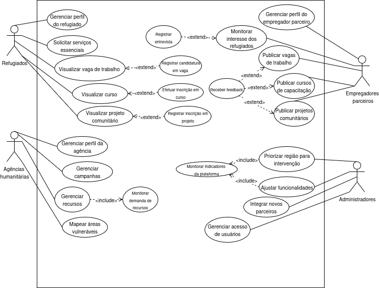

## Casos de Uso - HopeBridge

## Especificação de Caso de Uso: <Nome do Caso de Uso> 

### 1. Breve Descrição
[A descrição apresenta resumidamente a função e o objetivo do caso de uso. Um único parágrafo será suficiente para esta descrição.]: #

### 2. Fluxo Básico de Eventos
[Este caso de uso é iniciado quando o agente faz alguma coisa. Um agente sempre inicia casos de uso. O caso de uso descreve o que o agente faz e o que o sistema faz em resposta. Ele é expresso na forma de um diálogo entre o agente e o sistema.
O caso de uso descreve o que acontece dentro do sistema, mas não como ou por que. Se forem trocadas informações, seja específico sobre o que é transmitido de um lado para outro. Por exemplo, não é muito esclarecedor dizer que o agente digita informações do cliente se elas não forem definidas. É melhor dizer que o agente digita o nome e o endereço do cliente. Um Glossário de Termos (ou um Modelo de Domínio mais formal) é essencial para fazer com que a complexidade do caso de uso permaneça gerenciáveltalvez seja necessário definir coisas como informações do cliente lá para evitar que o caso de uso seja suprimido nos detalhes. 
Alternativas simples podem ser apresentadas no texto do fluxo de eventos. Se forem usadas apenas algumas sentenças para descrever o que acontece quando há uma alternativa, faça isso diretamente dentro do fluxo. Se o fluxo alternativo for mais complexo, utilize uma seção separada para descrevê-lo. Por exemplo, uma subseção Fluxo Alternativo explica como descrever alternativas mais complexas. 
O fluxo complexo de eventos deve ser melhor estruturado em sub-fluxos. Ao fazer isso, a meta principal deve ser aprimorar a clareza do texto. Os subfluxos podem ser chamados muitas vezes de muitos lugares. Lembre-se de que o caso de uso pode executar subfluxos em seqüências opcionais, em loops ou mesmo vários ao mesmo tempo.
Uma imagem, às vezes, vale mais que mil palavras, entretanto, não há substituto para a prosa limpa e clara. Se aprimorar a clareza, sinta-se à vontade para colar fluxogramas, diagramas de atividades ou outras figuras no caso de uso. Se um fluxograma for útil para apresentar um processo de decisão complexo, use-o sem dúvida! O mesmo acontece para o comportamento dependente de estado, um diagrama de transição de estado freqüentemente explica o comportamento de um sistema melhor que página e mais páginas de texto. Utilize o meio de apresentação certo para o problema, mas tenha cuidado ao utilizar terminologia, notações ou figuras que o público-alvo pode não entender. Lembre-se de que seu objetivo é explicar, não confundir.]: #

### 3. Fluxos Alternativos
[Alternativas mais complexas são descritas em uma seção separada, mencionada na subseção Fluxo Básico da seção Fluxo de Eventos. Pense nas subseções Fluxo Alternativo como um comportamento alternativo cada fluxo alternativo representa um comportamento alternativo geralmente devido às exceções que ocorrem no fluxo principal. Elas podem ter a extensão necessária para descrever os eventos associados ao comportamento alternativo.
Inicie cada fluxo alternativo com uma linha inicial determinando claramente onde o fluxo alternativo pode ocorrer e as condições em que ele é executado.
Encerre cada fluxo alternativo com uma linha que determina claramente onde os eventos do fluxo de eventos principal estão resumidos. Isso deve ser explicitamente determinado.
Utilizar fluxos alternativos aprimora a clareza do caso de uso. Tenha em mente que casos de uso são apenas descrições textuais e seu objetivo principal é documentar o comportamento de um sistema de uma maneira clara, concisa e compreensível.]: #

#### 3.1 <Área de Funcionalidade>
[Freqüentemente, há vários fluxos alternativos relacionados a uma única área de funcionalidade (por exemplo, recursos de retirada de especialista, manipulação de cartões ou de recebimentos para o caso de uso Caixa de Retirada de uma Máquina de Caixa Automático). Ela aprimorará a clareza se esses conjuntos de fluxos relacionados de forma conceptual forem agrupados em sua própria subseção nomeada claramente. ]: #

##### 3.1.1 < A1 Primeiro Fluxo Alternativo >
[Descreva o fluxo alternativo, exatamente como qualquer outro fluxo de eventos.]: #

##### 3.1.2 < A2 Segundo Fluxo Alternativo >
[Pode haver, e muito provavelmente haverá, vários fluxos alternativos em cada área de funcionalidade. Mantenha cada fluxo alternativo separado para aprimorar a clareza.]: #

#### 3.2 < Outra Área de Funcionalidade >

##### 3.2.1 < AN Outro Fluxo Alternativo >

### 4. Fluxos de Exceção

#### 4.1 < FE1 – Fluxo de Exceção >
[Um subfluxo deve ser um segmento de comportamento dentro do caso de uso que tenha um objetivo claro e seja "atômico" no sentido de que você execute todas ou nenhuma das ações descritas. Você pode precisar ter vários níveis de sub-fluxos, mas, se puder, evite, pois isso torna o texto mais complexo e difícil de entender.]: #

#### 4.2 < FE2 – Fluxo de Exceção >
[Pode haver, e muito provavelmente haverá, vários subfluxos em um caso de uso. Mantenha cada subfluxo separado para aprimorar a clareza. Utilizar subfluxos aprimora a clareza do caso de uso e também evita que os casos de uso sejam decompostos em hierarquias de casos de uso. Tenha em mente que casos de uso são apenas descrições textuais e seu objetivo principal é documentar o comportamento de um sistema de uma maneira clara, concisa e compreensível.]: #

### 5. Pré-Condições
[Uma condição prévia de um caso de uso é o estado do sistema que deve estar presente antes de um caso de uso ser executado.]: #

#### 5.1 < Condição Prévia Um >

### 6 Pós-Condições 
[Uma pós-condição de um caso de uso é uma lista de estados possíveis que o sistema pode estar imediatamente após um caso de uso ter sido concluído.]: #

#### 6.1 < Pós-condição Um  >

### 7. Pontos de Extensão
[Pontos de extensão do caso de uso.]: #

#### 7.1 < Nome do Ponto de Extensão >  
[Definição do local do ponto de extensão no fluxo de eventos.]: #

### 8. Requisitos Especiais
[Um requisito especial é, geralmente, um requisito não funcional que é específico de um caso de uso, mas não é fácil ou naturalmente especificado no texto do fluxo de eventos do caso de uso. Exemplos de requisitos especiais incluem requisitos legais e reguladores, padrões de aplicativos e atributos de qualidade do sistema a ser construído incluindo requisitos de utilidade, confiabilidade, desempenho ou suportabilidade. Adicionalmente, outros requisitoscomo sistemas e ambientes operacionais, requisitos de compatibilidade e restrições de designdevem ser capturados nesta seção.]: #
#### 8.1 < Primeiro Requisito Especial >

### 9. Informações Adicionais
[Inclua, ou forneça referências a, informações adicionais requeridas para explicar o caso de uso. Isso pode incluir diagramas de visão geral, exemplos ou qualquer outra coisa que você imagine.]: #

## Especificações dos Casos de Uso:

Caso de Uso: [Solicitar serviços essenciais](casos_de_uso/servicos.md)

## Histórico de Versão
Data     | Versão | Descrição | Autor(es) | Revisor(es)
-------- | ------ | --------- | ----- | ---------
01/07/2025 | 1.0 | Elaboração do diagrama de estudo de caso | Caio Venâncio e Willian Silva | Willian Silva |